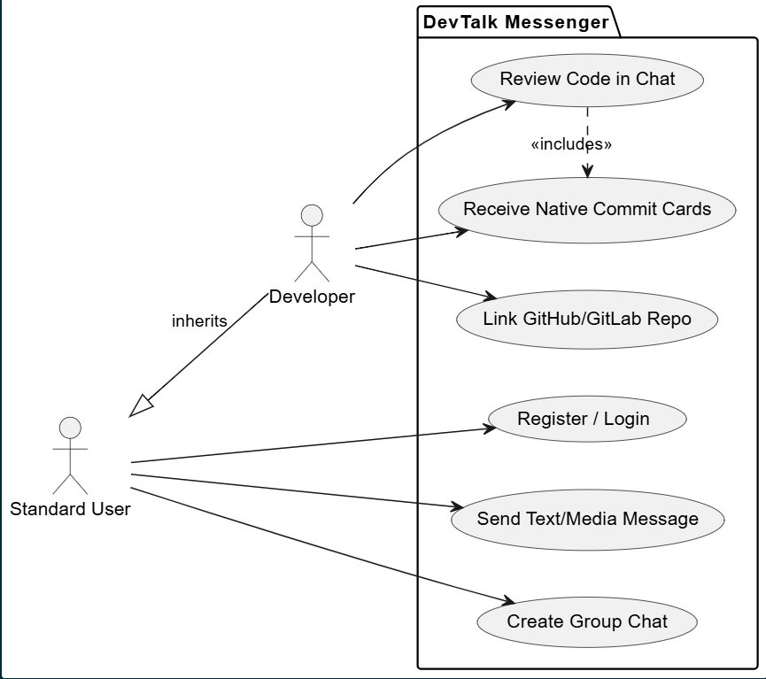
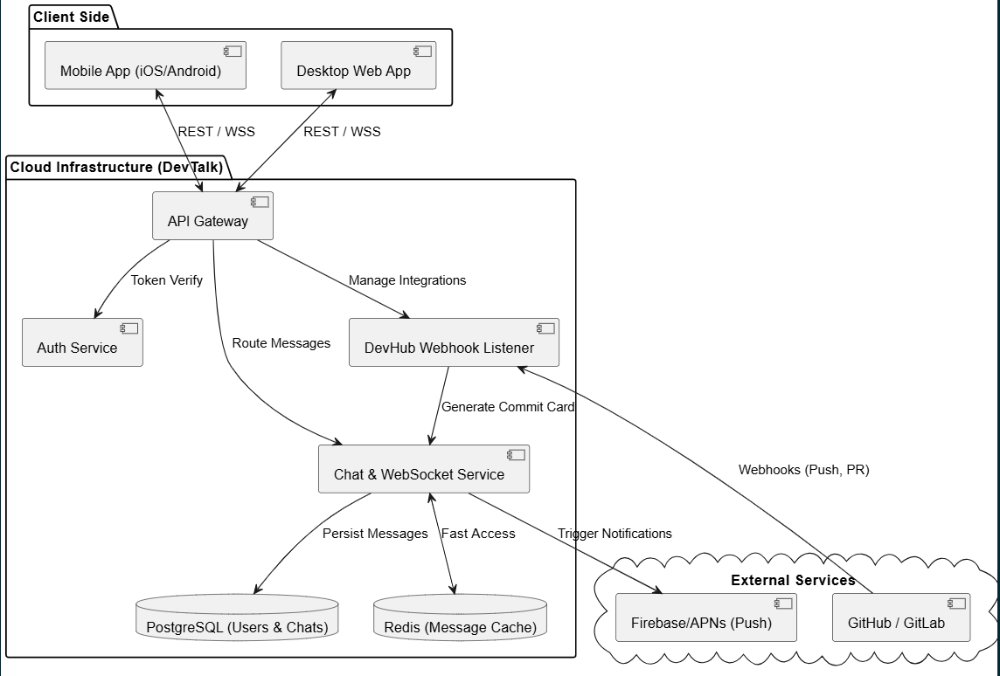
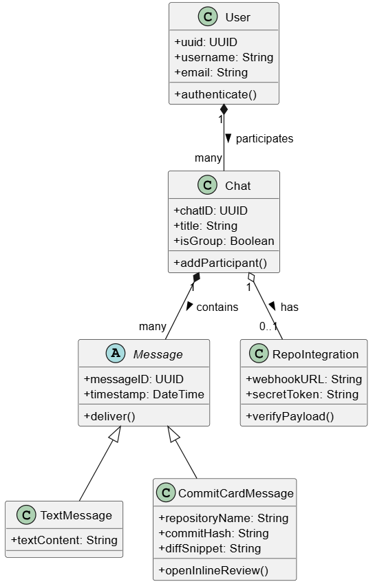
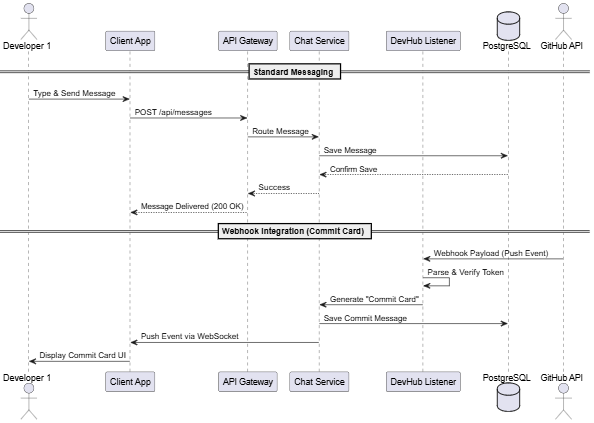
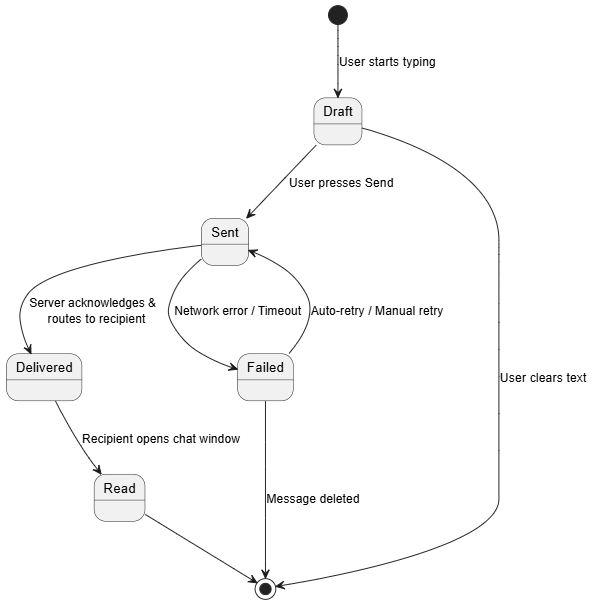
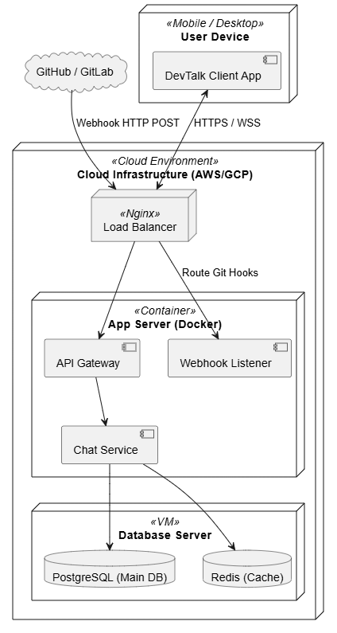

# Звіт з лабораторної роботи №1b
**Тема:** Проєктування архітектури програмної системи за допомогою UML.
**Варіант:** Месенджер (з розширеним функціоналом для IT-команд — "DevTalk").

## 1. Мета роботи
Розробити об'єктно-орієнтовану модель програмної системи (месенджера), використовуючи основні типи діаграм UML. Застосувати системний підхід до аналізу вимог та проєктування архітектури.

## 2. Опис предметної області (Ідея стартапу)
**DevTalk** — це сучасний месенджер, орієнтований на команди розробників. Його головна інновація полягає у нативній інтеграції з Git-репозиторіями (GitHub/GitLab) на рівні ядра системи. Замість використання сторонніх ботів, які засмічують чат текстом, DevTalk генерує інтерактивні "Картки комітів" (Commit Cards), дозволяючи проводити Code Review прямо в інтерфейсі діалогу.

## 3. Глосарій
* **User (Користувач)**: Зареєстрована особа, яка використовує систему для спілкування.
* **Message (Повідомлення)**: Одиниця даних (текст, медіа, код), що передається між користувачами.
* **Chat / GroupChat (Чат / Груповий чат)**: Ізольоване середовище для спілкування двох або більше користувачів.
* **DevHub Integration (Dev-Інтеграція)**: Інноваційна підсистема месенджера, що дозволяє нативно прив'язувати чати до репозиторіїв.
* **Commit Card (Картка коміту)**: Спеціальний UI-елемент повідомлення, який автоматично генерується системою при пуші коду.
* **Webhook Listener (Слухач вебхуків)**: Серверний компонент системи, який приймає HTTP-запити від зовнішніх сервісів (Git-провайдерів).
* **Push Notification (Push-сповіщення)**: Системне повідомлення на пристрій користувача.

---

## 4. Архітектурне моделювання (UML)

### 4.1. Діаграма варіантів використання (Use Case Diagram)
**Призначення:** Демонструє функціональні вимоги до системи з точки зору різних ролей користувачів.
**Опис:** Звичайні користувачі можуть реєструватися та створювати чати. Роль "Розробник" розширює ці права, додаючи можливість прив'язувати репозиторії та взаємодіяти з кодом прямо в чаті.
 ### 4.2. Діаграма компонентів (Component Diagram)
**Призначення:** Відображає фізичну структуру системи та зв'язки між її основними модулями.
**Опис:** Використовується мікросервісний підхід. Ядро складається з API Gateway, сервісу авторизації, WebSocket-сервісу для реал-тайм чату та унікального компонента `DevHub Webhook Listener`, який слухає події від зовнішніх систем.
 ### 4.3. Діаграма класів (Class Diagram)
**Призначення:** Описує статичну структуру бази даних та сутностей предметної області.
**Опис:** Головною особливістю моделі є використання поліморфізму для повідомлень (`abstract class Message`). Це дозволяє системі однаково легко обробляти як звичайні текстові повідомлення, так і інтерактивні картки коду.
 ### 4.4. Діаграма послідовності (Sequence Diagram)
**Призначення:** Відображає взаємодію об'єктів у часі під час виконання певного сценарію.
**Опис:** Змодельовано два паралельні процеси: стандартне відправлення повідомлення через API Gateway та асинхронне отримання Webhook-події від GitHub, що призводить до автоматичної генерації "Картки коміту" в чаті через WebSocket.
 ### 4.5. Діаграма станів (State Machine Diagram)
**Призначення:** Описує життєвий цикл ключової сутності системи.
**Опис:** Відображає стани об'єкта `Message`. Повідомлення проходить через стани `Draft` (Чернетка), `Sent` (Відправлено), `Delivered` (Доставлено) та `Read` (Прочитано). Також передбачено обробку помилок мережі (стан `Failed`).
 ### 4.6. Діаграма розгортання (Deployment Diagram)
**Призначення:** Показує фізичне розміщення артефактів системи на обчислювальних вузлах (серверах).
**Опис:** Серверна частина розгорнута у хмарному середовищі. Використовується Load Balancer для розподілу трафіку. Логіка загорнута в Docker-контейнери, а бази даних (PostgreSQL та Redis) винесені на окремі віртуальні машини для безпеки та швидкодії.
 ---

## 5. Висновки
В ході виконання роботи було спроєктовано архітектуру інноваційного месенджера DevTalk. Використання UML дозволило чітко розділити логіку на компоненти, визначити ролі користувачів та змоделювати гнучку ієрархію класів, готову до майбутнього масштабування. Динамічні діаграми довели спроможність системи працювати в асинхронному середовищі з використанням Webhook-інтеграцій.